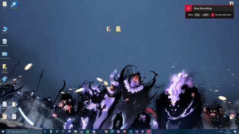

# ConvertToWebP
 Converts non-webp to webp images

## Usage
- Unzip the contents of ConvertToWebp.zip, in the folder where the files you want to convert to webP are.
- Start ConvertToWebp.exe
- Open Converted folder and enjoy your newly converted webp files.

